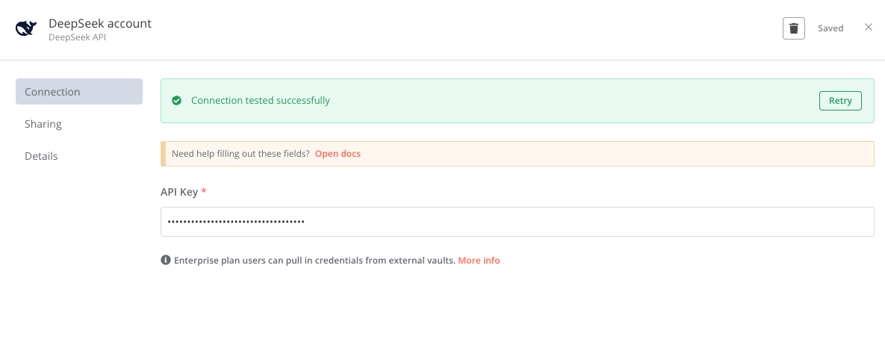
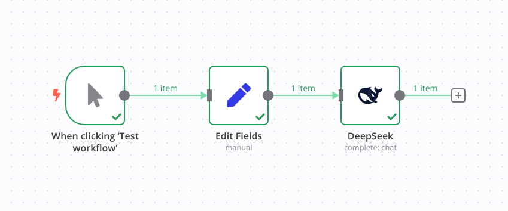
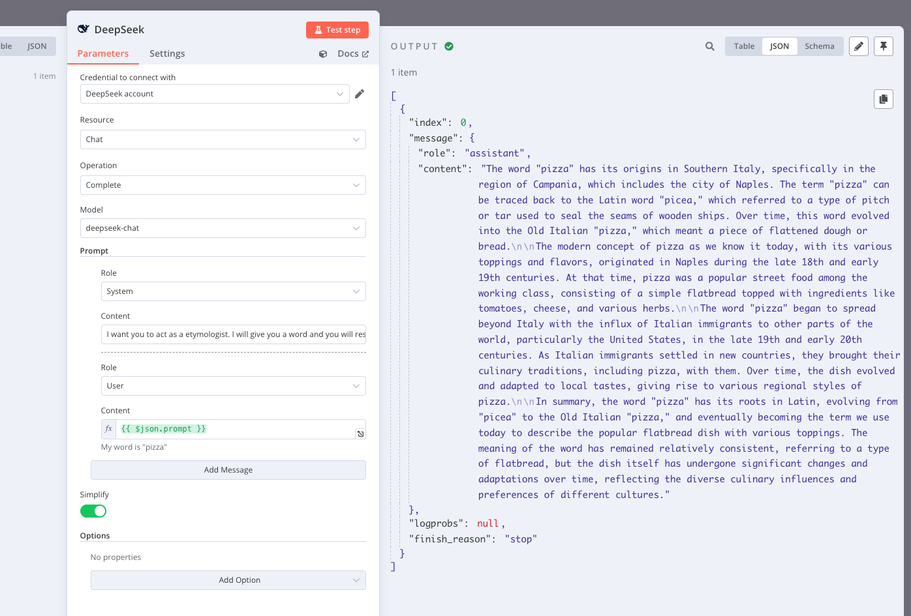

# n8n-nodes-deepseek

This is an n8n community node. It lets you use DeepSeek AI in your n8n workflows.

DeepSeek-V2 delivers impressive results on current major large model leaderboards.

DeepSeek WebSite: https://www.deepseek.com/en


[n8n](https://n8n.io/) is a [fair-code licensed](https://docs.n8n.io/reference/license/) workflow automation platform.

- [Installation](#installation)  
- [Credentials](#credentials)
- [Usage](#usage)
- [Resources](#resources)  

## Installation

Follow the [installation guide](https://docs.n8n.io/integrations/community-nodes/installation/) in the n8n community nodes documentation.

Use the package at [here](https://www.npmjs.com/package/n8n-nodes-deepseek).

## Credentials
Add your Api Key and store securely



## Usage

Add a DeepSeek node to your workflow, select the action you want to perform, and enter the required fields.



Run the workflow, and the result will be displayed in the Run Result node.



### A Simple Demo

```json
{
  "meta": {
    "instanceId": "8419fa436e34f85077f6eb7f63a9c97687d9df6ed55cfc53d58b3b86ab6d8e61"
  },
  "nodes": [
    {
      "parameters": {},
      "id": "a8c5f656-680b-4e43-b626-d3c85b1e21a1",
      "name": "When clicking ‘Test workflow’",
      "type": "n8n-nodes-base.manualTrigger",
      "typeVersion": 1,
      "position": [
        920,
        480
      ]
    },
    {
      "parameters": {
        "model": "deepseek-chat",
        "prompt": {
          "messages": [
            {
              "role": "system",
              "content": "I want you to act as a etymologist. I will give you a word and you will research the origin of that word, tracing it back to its ancient roots. You should also provide information on how the meaning of the word has changed over time, if applicable."
            },
            {
              "content": "={{ $json.prompt }}"
            }
          ]
        },
        "options": {},
        "requestOptions": {}
      },
      "id": "4841b428-7848-42d1-a0c6-f28c01a07010",
      "name": "DeepSeek",
      "type": "n8n-nodes-deepseek.deepSeek",
      "typeVersion": 1,
      "position": [
        1380,
        480
      ],
      "credentials": {
        "deepSeekApi": {
          "id": "WWBInhkKqwf808n4",
          "name": "DeepSeek account"
        }
      }
    },
    {
      "parameters": {
        "assignments": {
          "assignments": [
            {
              "id": "1b94a0dc-9b9b-4302-a1fd-2ac41b876740",
              "name": "prompt",
              "value": "My word is \"pizza\"",
              "type": "string"
            }
          ]
        },
        "options": {}
      },
      "id": "6e6054b0-bcb4-4fe3-83be-01cd7da39d93",
      "name": "Edit Fields",
      "type": "n8n-nodes-base.set",
      "typeVersion": 3.4,
      "position": [
        1160,
        480
      ]
    }
  ],
  "connections": {
    "When clicking ‘Test workflow’": {
      "main": [
        [
          {
            "node": "Edit Fields",
            "type": "main",
            "index": 0
          }
        ]
      ]
    },
    "Edit Fields": {
      "main": [
        [
          {
            "node": "DeepSeek",
            "type": "main",
            "index": 0
          }
        ]
      ]
    }
  },
  "pinData": {}
}
```

## Resources

- [n8n community nodes documentation](https://docs.n8n.io/integrations/community-nodes/)


## License

[MIT](https://github.com/n8n-io/n8n-nodes-starter/blob/master/LICENSE.md)
